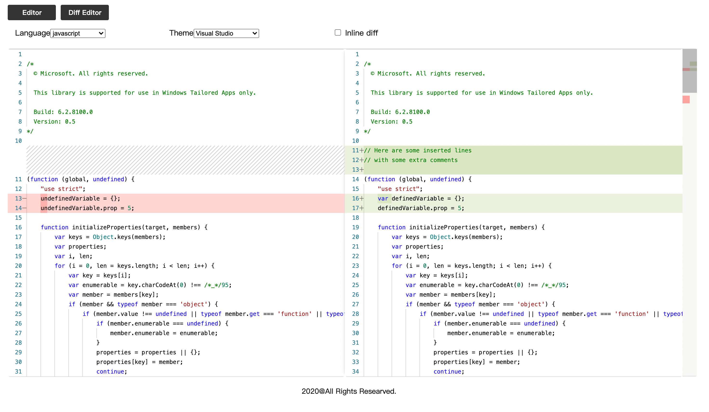
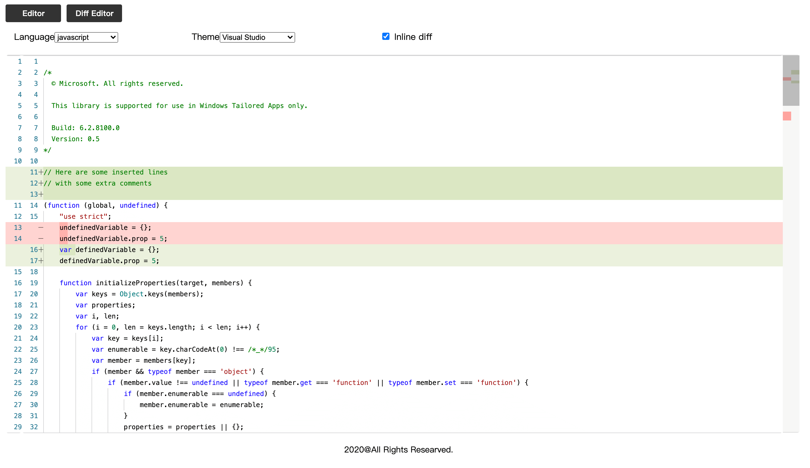

# Monaco Editor Demo

A simple example of monaco-editor.

## Deploying 

```bash
git clone https://github.com/PasteGo/monaco-editor-sample.git
```

Go to `dist/index.html` and explore the sample.

If you use the file protocol to access the Demo, it will not be able to load `sample.*.txt`。

We sincerely recommend you use a web container to run it, such as `Nginx`。

## Editor

If you write some simple `javascript`, you can run it.


## Diff Editor





